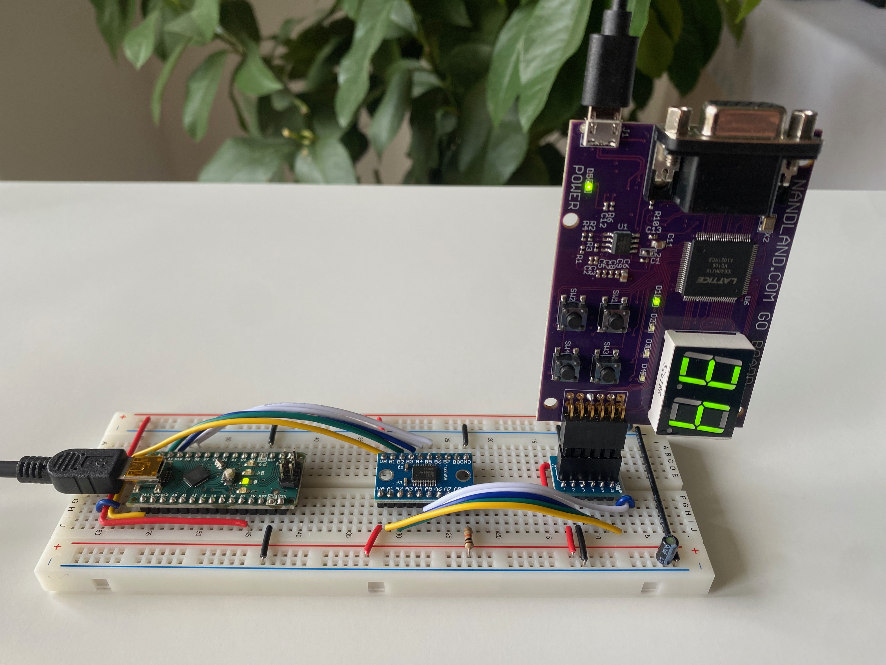
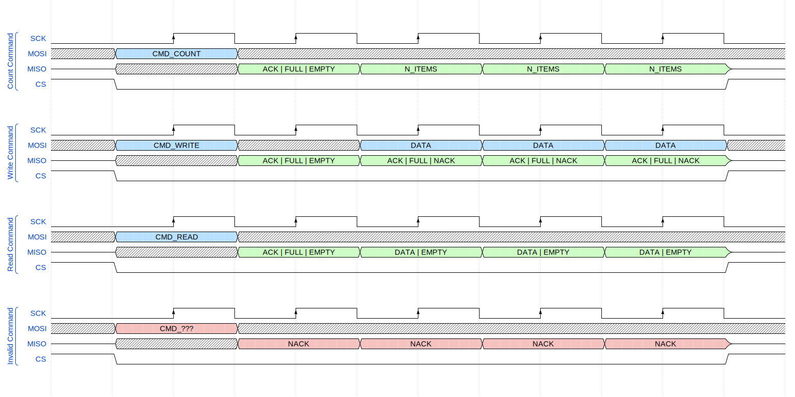
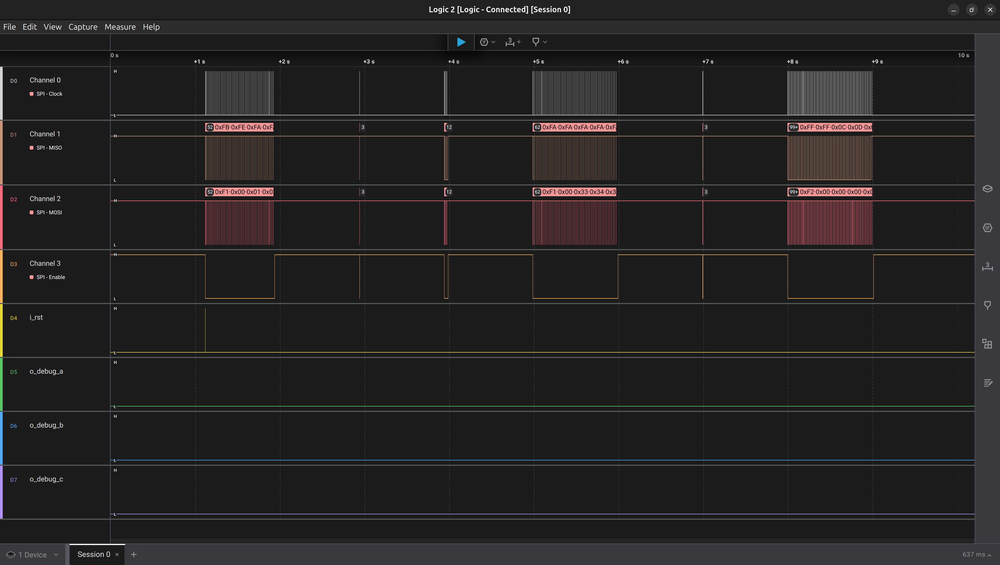
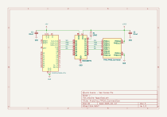

# The FPGA-Based FIFO

All in all, it's a FIFO queue.  
But it's implemented on an FPGA, and has a cool display showing its count.

Useful? Not *that* much...  
Interesting? You bet!



<br/>

## Index

- [Overview](#overview)
- [SPI Interface](#spi-interface)
- [Example SPI Session](#example-spi-session)
- [Hardware and Schematic](#hardware-and-schematic)
- [Breadboarding](#breadboarding)
- [Development Environment](#development-environment)
- [Coding Style](#coding-style)
- [Git](#git)
- [Credits](#credits)

<br/>

## Overview

This design implements a Block RAM based FIFO on an FPGA board, capable of holding up to 99 bytes.

At its core, it's a state machine that handles user commands *-- FIFO operations --* received via the SPI interface.

To add a visual touch, the item count is displayed in real time on the two onboard 7-segment displays.

<br/>

## SPI Interface

The FPGA module acts as an [**SPI Slave**](https://en.wikipedia.org/wiki/Serial_Peripheral_Interface) device in **Mode 0** (`CPOL=0`, `CPHA=0`).  

It recognizes these commands:

- `CMD_COUNT` -> `0xF0`: Read the item count
- `CMD_WRITE` -> `0xF1`: Write bytes to the FIFO
- `CMD_READ` -> `0xF2`: Read bytes from the FIFO

The module replies with:

- `ACK` -> `0xFA`: Command acknowledged
- `FIFO_EMPTY` -> `0xFE`: Command acknowledged, FIFO is empty
- `FIFO_FULL` -> `0xFF`: Command acknowledged, FIFO is full
- `NACK` -> `0xFB`: Command not acknowledged

<br/>

**Timing diagram:**



> [!NOTE]
> On `CMD_WRITE`, the device replies to each DATA byte with:
> * `ACK`       (`0xFA`): Byte written successfully
> * `FIFO_FULL` (`0xFF`): Byte written successfully, but the FIFO became full
> * `NACK`      (`0xFB`): Write failed (FIFO was already full)

<br/>

## Example SPI Session

Sometimes <s>a picture</s> an example is worth a thousand words.

This logic analyzer session captures the communication between the Arduino Nano and the FPGA board, with the SPI clock slowed to 5 kHz for easier debugging.

To view it:

1. [Install Logic2 from Saleae](https://www.saleae.com/downloads/) (it's free!)

2. Inspect this file: [`readme-assets/saleae-logic2-session.sal`](readme-assets/saleae-logic2-session.sal)



<br/>

The [following program](https://github.com/dehre/arduino-spi-fifo/blob/main/src/main.cpp) was running on the Arduino:

```cpp
ExtSerial.printf("Push 50 items, Count, Pop 10 items...");
uint8_t data_a[50];
for (size_t i = 0; i < sizeof(data_a); ++i)
    data_a[i] = 1 + i;
fpga::write(data_a, sizeof(data_a));
fpga::count();
fpga::read(10);

ExtSerial.printf("Push 60 items, Count, Pop 100 items...");
uint8_t data_b[60];
for (size_t i = 0; i < sizeof(data_b); ++i)
    data_b[i] = 51 + i;
fpga::write(data_b, sizeof(data_b));
fpga::count();
fpga::read(100);
```

<br/>

Want to see it in action? [Check it out on YouTube](https://www.youtube.com/watch?v=NBEfNmeHZOI)!

<br/>

## Hardware and Schematic

**Hardware components** used:

* [Go Board](https://nandland.com/the-go-board/) -- incorporating a [Lattice iCE40 HX1K](https://www.latticesemi.com/ice40/) FPGA

* [Arduino Uno](https://docs.arduino.cc/hardware/uno-rev3/), replaced in *stage-5* with the [Arduino Nano](https://docs.arduino.cc/hardware/nano/) (explained below)

* [Bi-Directional Logic Level Converter](https://www.ti.com/lit/ds/symlink/txs0108e.pdf)

<br/>

**Schematic**:



<br/>

## Breadboarding

The project kicked off with an **Arduino Uno** and **long jumper wires** connecting the components -- the quickest way to get started.

And it worked!  
Until SPI came into play.

That’s when issues with data integrity started creeping in.

[Quoting](https://forum.allaboutcircuits.com/threads/high-frequency-and-breadboards.38094/):

> Breadboards are great for low speed analog stuff.
> However, when you're working on digital circuits, you really need a lot of bandwidth. Realize that a square wave is made up from not only the fundamental frequency, but ALL of the odd harmonics of the fundamental.
> 
> In order to get a really decent 10kHz square wave, you really need around 200kHz of bandwidth. Breadboards have quite a bit of parasitic capacitance and inductance; and the interconnecting jumpers add inductance at a rate of 15nH per 10mm, or roughly 0.9uH per foot. It adds up _very_ quickly, and can wreak havoc with your circuit.

<br/>

Determined to stick with that breadboard setup, I initially patched things up by:

* Slowing the SPI clock to 5 kHz

* Adding small resistors (<50Ω) in series with the SPI lines to dampen high-frequency noise

* Setting unused PMOD pins to output-low to reduce interference

These tweaks kept things running, but as the project progressed, I became more dissatisfied with the limitations.

So I switched to the **Arduino Nano**, removed the resistors, and **reorganized
the breadboard** into a cleaner, more reliable layout [à la Ben Eater](https://www.youtube.com/@BenEater).

Result?  
I could boost the SPI clock speed to 2 MHz!

<br/>

## Development Environment

To set up the development environment for the Go Board, I recommend going through these two articles:

* https://nandland.com/download-and-install-the-fpga-tools-and-drivers/

* https://nandland.com/project-1-your-first-go-board-project/

Both the [iCEcube2 IDE](http://latticesemi.com/en/Products/DesignSoftwareAndIP/FPGAandLDS/iCEcube2.aspx) and the [Diamond Programmer](http://www.latticesemi.com/Products/DesignSoftwareAndIP/FPGAandLDS/LatticeDiamond) are free at the time of writing.

> [!TIP]
> **Note for Linux users**:  
> Only RHEL is supported, up to version 6 :unamused:.  
> Just run Windows on a virtual machine and call it a day.

<br/>

Do you own a Go Board, but don't want to build the project yourself?  
Here's the [bitstream file](readme-assets/SPIFIFO_bitmap.bin) for the Diamond Programmer.

Curious about the resource utilization report?  
[Take a look here](readme-assets/SPIFIFO_sbt.rpt).

<br/>

## Coding Style

VHDL is fairly liberal when it comes to style.

To keep things consistent and maintainable, I followed [this VHDL code guideline](https://nandland.com/recommended-coding-style-for-vhdl/).

<br/>

## Git

The git history for this project is structured into *stages*, with each commit on the `main` branch representing a self-contained step in development:

* `stage-1: count rising edges on PMOD pin 1 using onboard LEDs`
* `stage-2: count rising edges on PMOD pin 1 using 7-segment displays`
* `stage-3: create an spi slave loopback device using PMOD pins`
* `stage-4: create fifo queue and design state machine around it`
* `stage-5: remove unused entities and show fifo-count on the 7-segment displays`
* `stage-6: write additional testbenches`

This allowed me to revisit any stage where a feature was complete and
perfectly reproduce that setup by checking out the corresponding stage
in the [related Arduino project](https://github.com/dehre/arduino-spi-fifo/commits/main/).

If you're curious about how the project actually evolved, check the git history
in the feature branches (e.g. `stage-4--fifo`): I simply squash-merged them into `main` when they were ready.

<br/>

## Credits

Primary inspiration came from [Russell Merrick's book](https://nostarch.com/gettingstartedwithfpgas/).

Simulations have been run on [EDA Playground](https://www.edaplayground.com/).

[KiCad](https://www.kicad.org/) has been used to draw the schematic and [WaveDrom](https://wavedrom.com/) to create the timing diagram.
